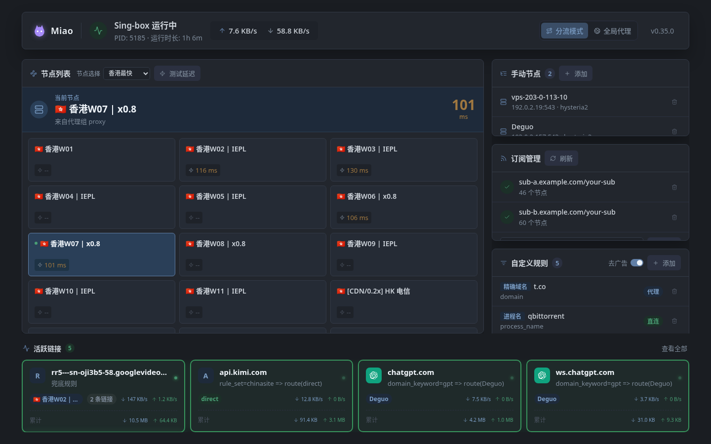

<div align="center">
  
  <h1>Miao</h1>
  <p><strong>开箱即用的透明代理</strong></p>
  <p>
    <a href="https://github.com/YUxiangLuo/miao/releases/latest"></a>
    <a href="https://github.com/YUxiangLuo/miao/actions/workflows/ci.yml"></a>
    
  </p>
</div>

在 Linux、路由器或 Windows 上搭分流代理，通常意味着：装内核、写配置、调防火墙，再找个面板。Miao 把控制面做成**同一套东西**——内嵌 sing-box、分流规则和 Web 面板。Linux / OpenWrt 是一个文件、`sudo` 跑、浏览器打开；Windows 是同一块面板外面套一层 Tauri 窗口，一次 UAC 代替 `sudo`。壳可以换，产品还是面板，不是配置编辑器。



## 30 秒上手（Linux）

```bash
mkdir -p ~/miao && cd ~/miao

# amd64（arm64 把文件名换成 miao-rust-linux-arm64）
wget https://github.com/YUxiangLuo/miao/releases/latest/download/miao-rust-linux-amd64 -O miao

chmod +x miao && sudo ./miao
```

浏览器打开 <http://localhost:6161>，按引导页添加订阅或节点即可。需要 root（TUN 所需）。找不到配置时先进引导页，不落盘任何文件。

### 用脚本装成 systemd 服务

手头已有二进制时，可离线装成开机自启：

```bash
sudo bash install.sh ./miao
```

装到 `/usr/local/bin/miao`，配置在 `/etc/miao`，单元是 `miao.service`。重复运行即升级。

```bash
systemctl status miao    # 状态
journalctl -u miao -f    # 日志
sudo bash remove.sh      # 卸载；-y 跳过确认
```

`remove.sh` 会停服务、删二进制、`/etc/miao`、`/tmp/miao-sing-box`，并清理残留 sing-box 进程和 `sing-tun` 网卡。

## Windows 桌面版

Win10/11 x64。哲学不变：还是 TUN 透明代理、还是这块面板、还是没配置就进引导页。变的只是外壳——Tauri 2 窗口加载本机 `http://127.0.0.1:<port>`，不重写 API，不重做 UI。

日常用法：

1. 下载 NSIS 安装包（装到当前用户，**安装本身不要管理员**）或 `miao-windows-amd64.zip`
2. 每次启动点一次 UAC（TUN / Wintun 要管理员；没有做成服务模式）
3. 窗口打开即铺满工作区，不能改大小；关窗口进托盘；托盘「退出」才停内核
4. 更新：先退出，再换安装包或 zip。面板里没有 Windows 一键升级
5. 出问题：托盘「打开日志」，文件在 `%LOCALAPPDATA%\io.github.yuxiangluo.miao\miao.log`

系统通常已有 WebView2，没有的话安装包走 bootstrapper。未签名时 SmartScreen 可能提示「仍要运行」。卸载会尽量结束残留内核，但当前用户安装包无权处理已提权的 `sing-box` / `sing-tun`；必要时重启或在设备管理器里删网卡。日志超过 8 MB 时启动自动轮转为 `miao.log.old`。

| | Linux / OpenWrt | Windows |
| --- | --- | --- |
| 拿到手 | 一个 musl 文件 | 安装包或便携 `miao.exe`（要 WebView2） |
| 提权 | `sudo` | 每次运行 UAC |
| 面板 | 浏览器打开 `localhost:6161`，默认听 `0.0.0.0` | 自带窗口，听 `127.0.0.1` |
| 配置 | `/etc/miao/config.yaml` | `%LOCALAPPDATA%\io.github.yuxiangluo.miao\config.yaml` |
| 运行时内核 | `/tmp/miao-sing-box` | `%TEMP%\miao-sing-box` |
| TUN | `auto_route` + Linux 的 `auto_redirect` | `auto_route` + `strict_route`，**没有** `auto_redirect` |
| 内核 | 内嵌 Linux sing-box | 内嵌 Windows sing-box（Wintun 已编进内核，不必再带 dll） |
| 一键升级 / VPS 部署 | 有 | 不编进桌面进程 |
| 开机自启 | `install.sh` → systemd | 无（先每次双击） |

正式发版会把三个架构钉到流水线当场解析出的同一个 sing-box 提交；手动构建默认拉默认分支，可用 `SING_BOX_REF` 覆盖（分支/tag/完整 commit sha 均可）。

## 面板里有什么

Linux 和 Windows 是同一块 React 面板。

| 模块 | 能做什么 |
| --- | --- |
| 服务状态 | 启停 sing-box、实时上下行速率、PID 与运行时长 |
| 代理模式 | 规则分流（国内直连 / 国外代理）⇄ 全局代理，一键切换 |
| 节点选择 | 网格化节点列表，单个/批量延迟测试，点击即切换，重启后自动恢复上次选择 |
| 链接统计 | 活动连接按站点聚合：实时速度、累计流量，展开可看每条连接明细 |
| 自定义规则 | 域名/IP/端口/进程名/进程路径等条件，目标可直连/代理/拦截/**指定节点**；节点失效自动跳过并在列表标记提醒 |
| 去广告 | 内嵌广告规则集，路由层拦截，一键开关 |
| 手动节点 | 粘贴分享链接批量导入，或手动填写（高级参数折叠收纳） |
| 订阅管理 | 添加/刷新 Clash YAML 订阅，失败自动回退缓存配置 |
| 版本升级 | 仅 Linux：检测新版本并面板内一键自升级。Windows：退出后换安装包 |

## 节点怎么来

1. **订阅**——Clash YAML 订阅链接
2. **粘贴分享链接**——`hysteria2://` `hy2://` `ss://` `vmess://` `vless://` `trojan://` `tuic://` `anytls://`，每行一条
3. **VPS 一键部署**（仅 Linux）——「添加节点 → VPS 部署」填 IP 和 root 密码，远端装 Hysteria2 并把节点写回本地；密码只用于本次，不保存

## 它是怎么工作的

```
Windows 用户                         Linux / OpenWrt 用户
    │ 未提权则 UAC 重拉                    │ sudo
    ▼                                     ▼
Tauri 窗口（只当浏览器）              系统浏览器
    │ 打开 http://127.0.0.1:<port>        │ 打开 http://localhost:6161
    ▼                                     ▼
              同一套 miao-core（axum + 配置事务 + Clash 反代）
                            │
                            ▼
              内嵌 sing-box（Windows 内核已含 Wintun）
              TUN 适配器 sing-tun
```

- 透明代理走 sing-box TUN。Linux 用 `auto_route` + `auto_redirect`（nftables）；Windows 只用 `auto_route` + `strict_route`，不手写防火墙
- DNS 双轨：国外经代理走 Cloudflare DoH，国内直连 223.5.5.5；缓存落在运行时 `cache.db`
- 面板通过 Clash API（`127.0.0.1:6262`）切节点、读连接；配置变更先 `sing-box check` 再热重启
- 内核与规则集每次启动重新释放，保证与当前二进制一致；`cache.db` / 配置缓存有意保留
- 内核异常退出会自动拉起（退避重试，连续失败后面板告警）

## 配置参考（进阶）

不创建任何文件也能用。查找顺序：`--config` → 可执行文件同目录的 `config.yaml` → 平台默认路径（Linux `/etc/miao/config.yaml`，Windows `%LOCALAPPDATA%\io.github.yuxiangluo.miao\config.yaml`）。

```yaml
port: 6161                 # 面板端口

subs:                      # Clash YAML 订阅
  - "https://your-subscription-url"

nodes:                     # 手动节点（sing-box outbound JSON）
  - '{"type":"hysteria2","tag":"HY2","server":"example.com","server_port":443,"password":"xxx","tls":{"enabled":true}}'

custom_rules:              # 可选：优先于内置分流，全局模式下仍生效
  - '{"domain_suffix":"example.com","action":"route","outbound":"direct"}'
  # Linux 进程名常是 curl；Windows 常是 qbittorrent.exe
  - '{"process_name":"qbittorrent","action":"route","outbound":"香港节点"}'

adblock: true              # 可选：去广告，默认关闭
```

面板里的分流/全局模式是会话级状态，重启后回到规则分流，不写进配置文件。

## 从源码构建

依赖：Bun、Go、Rust、curl。克隆后：

```bash
./build.sh        # Linux 本机架构：前端 + 内核 + target/release/miao-rust
```

`embedded/` 下的 sing-box 与规则集不入库。fresh clone 先 `./scripts/build-embedded.sh` 或直接 `./build.sh`。内核默认拉 sing-box 仓库默认分支，可用 `SING_BOX_REF` 覆盖。

编 Windows 内核（在 Linux 上交叉 Go，不跑 TUN）：

```bash
MIAO_TARGET=windows-amd64 ./scripts/build-embedded.sh
# 产物: embedded/sing-box-windows-amd64.exe
```

桌面壳在 workspace 里，但不是 default member（避免 Linux `cargo test` 去链 WebView）：

```bash
cargo build -p miao-desktop            # 本机有 webkit 才能编；不要当「已验证 Windows TUN」
cargo check -p miao-core --target x86_64-pc-windows-gnu
```

安装包 / zip 由 tag 上的 `windows-latest` job 出，本机 Arch 不出 NSIS。

开发前端：

```bash
bun run --cwd frontend dev      # API 代理到 localhost:6161
bun run --cwd frontend test
cargo test --locked --all-targets
```

改前端后必须 `./scripts/build-frontend.sh` 再编 Rust：`include_str!` 嵌的是 `public/index.html`，只 `cargo build` 还是旧页面。

## 技术栈

Rust（axum）控制面 · 内嵌 sing-box · React + Vite 面板（打成单文件 HTML 嵌进二进制）· Windows 上再用 Tauri 2 当窗口 · GitHub Actions 编 Linux musl 与 Windows 桌面壳
